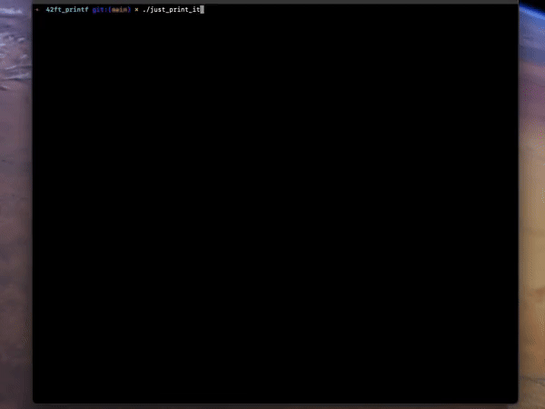

# 42ft_printf
## Yesterday you said tomorrow just print it

Oh, yeah, its a recoded printf() from the standard library!



Above you see me running my own tests which compare the result of  ```ft_printf()``` to the standard library ```printf()``` function.
You can find the tests in the ```test``` folder. There are two files, one for the mandatory and one for the bonus part.

The function among its bonus part, has been heavily unit tested by myself, fellow students and ***[online testers](https://github.com/Tripouille/printfTester)***.

The function handles the following conversions: 
  - ```%c``` for characters
  - ```%s``` for strings
  - ```%p``` for pointers
  - ```%d``` for signed decimal integers
  - ```%i``` for signed decimal integers
  - ```%u``` for unsigned decial integers
  - ```%x``` for unsigned hexadecimal integers (lowercase)
  - ```%X``` for unsigned hexadecimal integers (uppercase)
  - ```%%``` for percent signs

Under the bonus section, the function also supports the **field minimum width** under all conversions and **any combination** of the following flags:
  - ```-``` -> the converted value is to be left adjusted on the field boundary
  - ```0``` -> the value should be zero padded
  - ```.``` -> precision followed by an optional decimal digit string

Also these flags are supported:
  - ```#``` -> the value should be converted to an "alternate form"
  - ``` ``` -> leave blank before a positive number (or empty string) produced by a signed conversion
  - ```+``` -> a sign (+ or -) should always be placed before a number produced by a signed conversion

This was my third project in **Hive Helsinki** and it introduced **variadic functions** in C.

I actually finished this project in early **2023** but wanted to redo the commit history and write a more comprehensive README file.

## 📖 Topics
  - Variable argument lists
  - Parsing
  - Memory management
  - Code modularity
  - Unit testing

## 🛠️ Langs/Tools
  - C
  - Makefile

## 🦉 Getting started

Because the makefile just builds a library containing the function, we need to link during compilation:

  1. ```git clone https://github.com/kenlies/42ft_printf```
  2. ```cd 42ft_printf```
  3. ```make``` **or** ```make bonus``` for bonus section
  4. ```gcc test/test_m.c -I./include -L . -lftprintf``` for mandatory part tests

      **or**

     ```gcc test/test_b.c -I./include -L . -lftprintf``` for bonus part tests
  6. ```./a.out```

## 💸 Bonus section

It was required to handle three of the flags in any combination, handle field minimun width and then lastly just the rest of the flags.
If you decided to do the bonus, it utterly changed the nature of this project. It adds extensive complexity by means of the possible random configuration of flags supplied.
This required additional thought right from the start to avoid a naive approach and subsequent headache.

## 🔨 To improve

Some memory allocations could be avoided by better designing the whole structure. Also code modularity could be improve upon.
